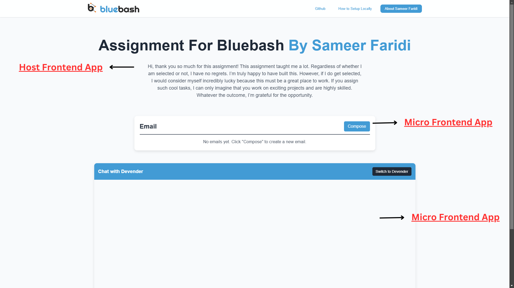

# Microfrontend assignment for BlueBash


This is a **Microfrontend (MFE) assignment Application** using **Webpack Module Federation**. The application is divided into different micro frontends, each responsible for a specific feature, and integrated into a shell/container application.




## Features
- Uses **Webpack Module Federation** for dynamic module sharing.
- Microfrontends include **Chat App** and **Email App**.
- Lazy loading using **React Suspense**.

## Project Structure
```
/microfrontend-assignment
  ├── /host        # Host
  ├── /chat-app    # Microfrontend 
  ├── /email-app   # Microfrontend
  |         
  ├── package.json
  ├── README.md
  ├── webpack.config.js
```

## Getting Started

### 1. Prerequisites
Ensure you have the following installed:
- **Node.js** (>= 16)
- **npm** or **yarn**

### 2. Clone the Repository
```sh
git clone https://github.com/your-repo/microfrontend-assignment.git
cd microfrontend-assignment
```

### 3. Install Dependencies
Run the following command in the root directory to install dependencies for all applications:
```sh
npm install
```

### 4. Start Applications
To start all microfrontend servers, run:
```sh
npm start
```

Each app should now be running on different ports (e.g., `http://localhost:3000`, `http://localhost:3001`, etc.).

## Webpack Module Federation Setup
Each Microfrontend has its own **webpack.config.js** with `ModuleFederationPlugin`:

```js
new ModuleFederationPlugin({
  name: 'chatApp',
  filename: 'remoteEntry.js',
  exposes: {
    './ChatApp': './src/ChatApp',
  },
  shared: ['react', 'react-dom'],
})
```

The **Container App** consumes the remote apps dynamically:

```js
new ModuleFederationPlugin({
  remotes: {
    ChatApp: 'chatApp@http://localhost:3001/remoteEntry.js',
    EmailApp: 'emailApp@http://localhost:3002/remoteEntry.js',
  },
})
```

## How It Works
1. The **Container App** dynamically loads the Chat and Email apps at runtime.
2. Each Microfrontend is independently deployed and shares React dependencies.
3. Lazy loading ensures smooth performance using React Suspense.
4. Module Federation handles cross-app imports without code duplication.

## Credits
Developed by **@sameerkali** | For a amazing assignment given by Bluebash.

